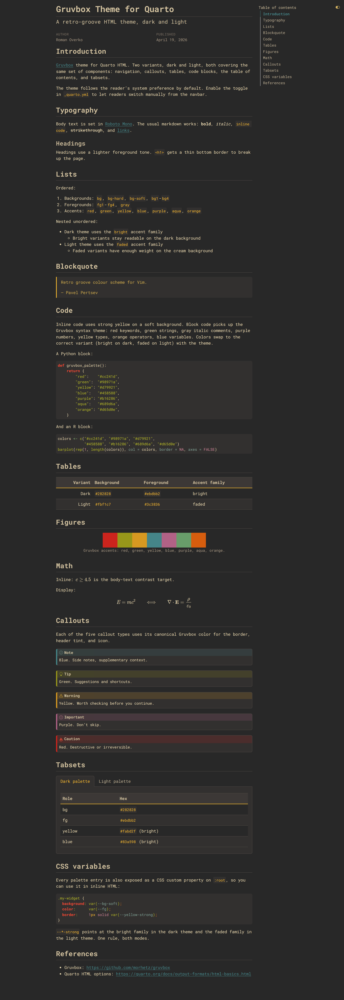
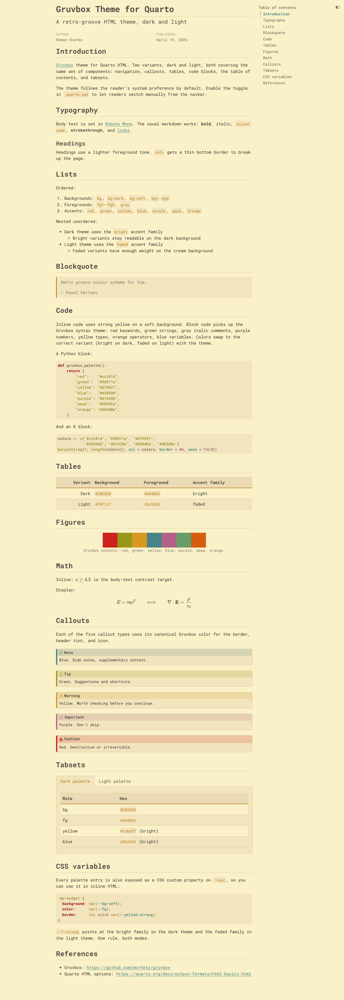

# Gruvbox for Quarto

[Gruvbox](https://github.com/morhetz/gruvbox) theme for Quarto HTML.
Dark and light variants covering navigation, callouts, tables, code
blocks, the table of contents, and tabsets.




## Install

Add the extension to an existing project:

```bash
quarto add roman1e2f5p8s/quarto-gruvbox
```

Or start a new document from the template:

```bash
quarto use template roman1e2f5p8s/quarto-gruvbox
```

## Use

In your document's YAML header:

```yaml
format:
  gruvbox-html: default
```

The theme follows the reader's system preference by default. Enable the
toggle in `_quarto.yml` to let readers switch from the navbar.

## What's included

- The full Gruvbox palette, as SCSS variables (`$red`, `$yellow`,
  `$yellow-bright`, `$yellow-faded`, ...) and as CSS custom properties
  on `:root`.
- Bootstrap semantic colors (`$primary`, `$success`, etc.) mapped onto
  Gruvbox tones, so `.btn-primary`, `.alert-success`, and similar
  classes match the palette.
- Syntax highlighting for code blocks mapped to Gruvbox: red keywords,
  green strings, gray italic comments, purple numbers, yellow types,
  orange operators, blue variables. Swaps between bright (dark mode)
  and faded (light mode) palettes with the theme.
- Styled components: navbar, sidebar, TOC, all five callout types,
  tables, code blocks, blockquotes, tabsets, tippy tooltips, search,
  footer, scrollbar, selection.
- [Roboto Mono](https://fonts.google.com/specimen/Roboto+Mono) as the
  default body font.

## Portable accents for inline HTML

When you want accents that follow the active theme, use the `--*-strong`
CSS custom properties:

```css
.my-widget {
  background: var(--bg-soft);
  color:      var(--fg);
  border:     1px solid var(--yellow-strong);
}
```

`--*-strong` points at the bright variant under the dark theme and the
faded variant under the light theme. One rule, both modes.

## Example

See [`template.qmd`](template.qmd) for a showcase of every styled
component. Render it with:

```bash
quarto render template.qmd
```

## Customize

To layer your own SCSS on top, pass both files in the document YAML:

```yaml
format:
  gruvbox-html:
    theme:
      dark:  [_extensions/gruvbox/gruvbox-dark.scss,  overrides.scss]
      light: [_extensions/gruvbox/gruvbox-light.scss, overrides.scss]
```

Every palette value is a named SCSS variable, so you can redefine them
in `overrides.scss` without touching the source files.

## License

[MIT](LICENSE).

## Credits

Gruvbox palette by [Pavel Pertsev](https://github.com/morhetz/gruvbox).

Built with assistance from [Claude Code](https://claude.com/claude-code).
